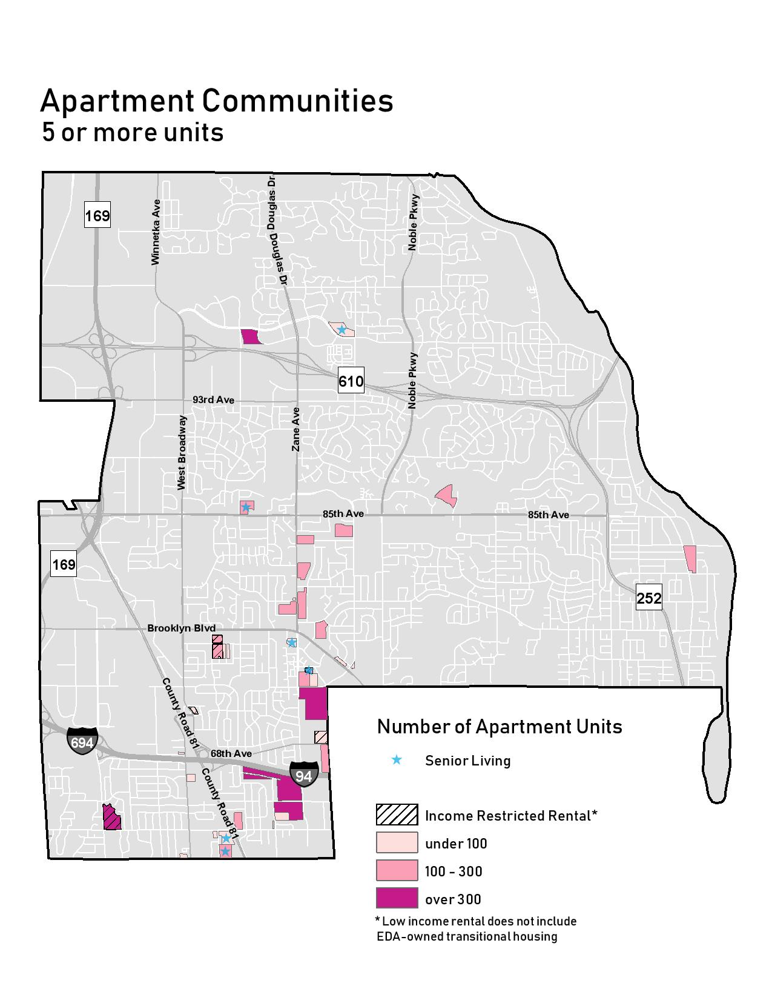
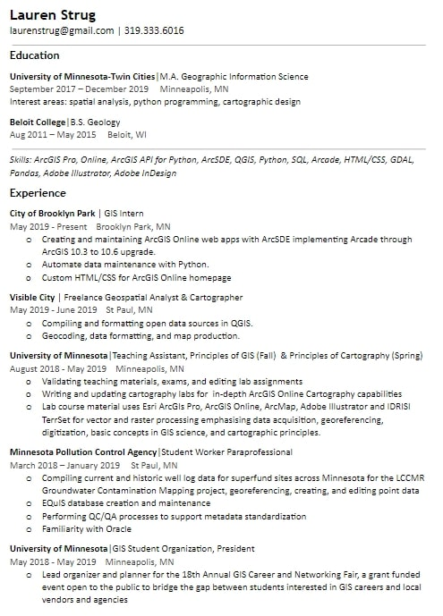

Lauren is a geospatial analyst focused on data-driven solutions with GIS, cartographic design, and geocomputation. She is currently earning a Masters of GIS at the University of Minnesota.  In her free time she likes to cook, paint, and go for long bike rides.

## Projects

#### Brooklyn Park ArcGIS Online Web Apps
[Public Schools](http://brooklynpark.maps.arcgis.com/apps/webappviewer/index.html?id=7397e3a072dd4b5cadc1444bbe456d68)

[Outdoor Warning Sirens](http://brooklynpark.maps.arcgis.com/apps/webappviewer/index.html?id=74c9e566380c45eb95c575e71932973b)

[Apartment Finder](http://brooklynpark.maps.arcgis.com/apps/webappviewer/index.html?id=b23aa0521ef34bb19d89f3b0f25a434d)

[SkimStop Participants](http://brooklynpark.maps.arcgis.com/apps/webappviewer/index.html?id=28f28a73beac4a1e85ba567655ee02b9)

#### Static Maps
[mars map]

[northeast minnesota]

## Resume

[Click for downloadable PDF Resume](Resume_Strug2019.pdf)

